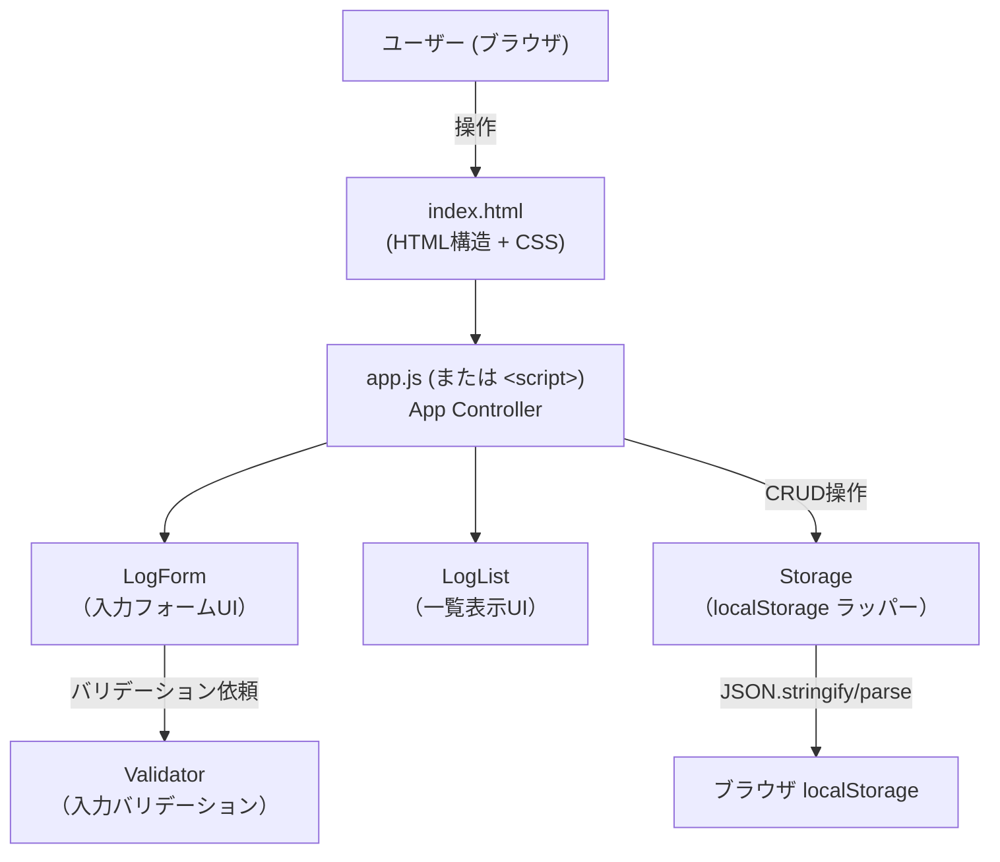

# Design Document: work-log

## Overview

work-log は、開発者が日々の作業内容・作業時間・日付を記録・管理できるシンプルなWebアプリケーションです。

### 設計方針

- **フレームワーク不使用**: HTML、CSS、JavaScript (ES6+) のみで構築し、ビルドツール・依存関係ゼロで動作する
- **シングルページ構成**: 単一の `index.html` にHTML・CSS・JavaScriptをまとめ、サーバー不要でそのままブラウザで開ける
- **関心の分離**: UI層（LogForm / LogList）、ビジネスロジック層（Validator）、データ層（Storage）を明確に分離し、各層を独立してテスト可能にする
- **永続化**: ブラウザの localStorage に JSON 形式で保存し、ページリロード後もデータを保持する

### リサーチ知見の要約

| 領域 | 採用アプローチ |
|------|--------------|
| localStorage | `JSON.stringify` / `JSON.parse` でシリアライズ。`setItem` は `QuotaExceededError` をスローするため必ず `try/catch` でラップする ([参考: mmazzarolo.com](https://mmazzarolo.com/blog/2022-06-25-local-storage-status/)) |
| 日付バリデーション | 正規表現 `/^\d{4}-\d{2}-\d{2}$/` でフォーマット確認後、`new Date(value)` を構築して月・日の一致を検証することで実在しない日付（例: 2023-02-30）を弾く |
| アクセシビリティ | `<label for="id">` による明示的関連付けが WCAG 2.1 SC 1.3.1 準拠の推奨方法 ([W3C WAI](https://www.w3.org/WAI/tutorials/forms/labels/)) |
| フォーカス管理 | WCAG 2.4.7 に準拠し、フォーカス受け取り要素に `outline` などのビジュアルインジケーターを必ず表示する |

---

## Architecture



### アーキテクチャの決定事項

**単一HTMLファイル vs 複数ファイル分割**

単一 `index.html` に全コードを収める構成を採用します。理由：
- サーバー不要でローカルファイルとして直接開ける
- ファイル間の相対パス問題が発生しない
- デプロイが最もシンプル（HTMLファイル1つ）

ただし、保守性のために `<script>` 内は以下の論理セクションに明確に分離します：

1. `Storage` モジュール
2. `Validator` モジュール
3. `LogForm` モジュール
4. `LogList` モジュール
5. `App` 初期化・イベント接続

---

## Components and Interfaces

### Storage モジュール

localStorage へのアクセスをカプセル化し、エラーハンドリングを一元管理します。

```javascript
const Storage = {
  STORAGE_KEY: 'work-log-entries',

  /**
   * WorkLog リストを localStorage から読み込む
   * @returns {WorkLog[]} - 保存済みの WorkLog 配列。失敗時は空配列
   */
  load(): WorkLog[],

  /**
   * WorkLog リストを localStorage に保存する
   * @param {WorkLog[]} logs
   * @returns {{ success: boolean, error?: string }}
   */
  save(logs: WorkLog[]): { success: boolean, error?: string },
};
```

**設計上の注意点:**
- `load()` は `JSON.parse` の例外をキャッチし、失敗時は空配列を返してコンソールにエラーを出力する
- `save()` は `setItem` が `QuotaExceededError` をスローした場合に既存データを変更せず、呼び出し元にエラーを返す

### Validator モジュール

フォーム入力値のバリデーションロジックを純粋関数として実装します（副作用なし）。

```javascript
const Validator = {
  /**
   * 作業内容を検証する
   * @param {string} value
   * @returns {{ valid: boolean, message?: string }}
   */
  validateDescription(value: string): ValidationResult,

  /**
   * 作業時間を検証する（1〜480の整数）
   * @param {string|number} value
   * @returns {{ valid: boolean, message?: string }}
   */
  validateDuration(value: string | number): ValidationResult,

  /**
   * 日付を検証する（YYYY-MM-DD形式かつ実在する日付）
   * @param {string} value
   * @returns {{ valid: boolean, message?: string }}
   */
  validateDate(value: string): ValidationResult,

  /**
   * WorkLog 全フィールドを一括検証する
   * @param {{ description: string, duration: string, date: string }} fields
   * @returns { errors: { description?: string, duration?: string, date?: string } }
   */
  validateAll(fields): { errors: Record<string, string> },
};
```

**日付バリデーションロジック:**

```javascript
validateDate(value) {
  if (!value) return { valid: false, message: '日付を入力してください' };
  // フォーマット確認
  if (!/^\d{4}-\d{2}-\d{2}$/.test(value)) {
    return { valid: false, message: '有効な日付を入力してください' };
  }
  // 実在日付確認: 2023-02-30 のような存在しない日付を弾く
  const [y, m, d] = value.split('-').map(Number);
  const date = new Date(y, m - 1, d);
  if (date.getFullYear() !== y || date.getMonth() !== m - 1 || date.getDate() !== d) {
    return { valid: false, message: '有効な日付を入力してください' };
  }
  return { valid: true };
}
```

### LogForm コンポーネント

フォームのDOM操作・バリデーションエラー表示・送信後リセットを管理します。

```javascript
const LogForm = {
  /**
   * フォームを初期化し、送信イベントにハンドラを登録する
   * @param {function(WorkLogInput): void} onSubmit - 有効な入力が渡されるコールバック
   */
  init(onSubmit: (input: WorkLogInput) => void): void,

  /**
   * フォームの全フィールドをリセットする
   */
  reset(): void,

  /**
   * 保存失敗エラーを表示する
   * @param {string} message
   */
  showSaveError(message: string): void,
};
```

### LogList コンポーネント

WorkLog 一覧のDOM描画・削除ボタンのイベント登録を管理します。

```javascript
const LogList = {
  /**
   * WorkLog リストをDOMに描画する
   * @param {WorkLog[]} logs
   * @param {function(string): void} onDelete - 削除対象の id が渡されるコールバック
   */
  render(logs: WorkLog[], onDelete: (id: string) => void): void,
};
```

### App コントローラー

各コンポーネントを組み合わせ、アプリ全体のフローを制御します。

```javascript
const App = {
  /**
   * アプリを初期化する（DOMContentLoaded 時に呼び出す）
   */
  init(): void,

  /**
   * WorkLog を追加する（LogForm の onSubmit コールバック）
   */
  addLog(input: WorkLogInput): void,

  /**
   * WorkLog を削除する（LogList の onDelete コールバック）
   */
  deleteLog(id: string): void,
};
```

---

## Data Models

### WorkLog

作業記録の1件分のデータ構造です。

```javascript
/**
 * @typedef {Object} WorkLog
 * @property {string} id          - 一意な識別子（`Date.now().toString(36) + Math.random().toString(36).slice(2)` で生成）
 * @property {string} description - 作業内容（1〜200文字）
 * @property {number} duration    - 作業時間（分単位、1〜480の整数）
 * @property {string} date        - 作業日付（YYYY-MM-DD形式）
 * @property {number} createdAt   - 登録日時（Unix タイムスタンプ、ミリ秒）
 */
```

### WorkLogInput

フォームから受け取る入力値の一時的な型です。

```javascript
/**
 * @typedef {Object} WorkLogInput
 * @property {string} description
 * @property {string} duration    - フォームから受け取る際は文字列
 * @property {string} date
 */
```

### ValidationResult

バリデーション結果を表す型です。

```javascript
/**
 * @typedef {Object} ValidationResult
 * @property {boolean} valid
 * @property {string} [message] - エラーメッセージ（invalid の場合のみ）
 */
```

### localStorage のデータ形式

```json
// キー: "work-log-entries"
// 値: WorkLog[] を JSON.stringify した文字列
[
  {
    "id": "lax2k3abc",
    "description": "APIエンドポイント設計",
    "duration": 90,
    "date": "2024-07-15",
    "createdAt": 1721044800000
  },
  {
    "id": "lb0x9q8de",
    "description": "ユニットテスト作成",
    "duration": 60,
    "date": "2024-07-14",
    "createdAt": 1720958400000
  }
]
```

---

## Correctness Properties

*A property is a characteristic or behavior that should hold true across all valid executions of a system — essentially, a formal statement about what the system should do. Properties serve as the bridge between human-readable specifications and machine-verifiable correctness guarantees.*

### Property 1: Storage ラウンドトリップ

*For any* 有効な WorkLog リスト（0件以上）について、`Storage.save()` でシリアライズしてから `Storage.load()` でデシリアライズした結果が、元のリストと同一件数・同一フィールド値（id・description・duration・date・createdAt）で等価であること

**Validates: Requirements 4.4, 4.1, 4.2, 4.3**

### Property 2: 不正JSON耐性

*For any* 不正なJSON文字列（空文字列、数値文字列、JSONではない任意の文字列）が localStorage に設定されている場合、`Storage.load()` は例外をスローせず常に空配列を返すこと

**Validates: Requirements 4.5**

### Property 3: バリデーション — 作業内容長

*For any* 長さが1〜200文字の文字列に対して `Validator.validateDescription()` は `valid: true` を返し、長さが0または201文字以上の文字列に対しては `valid: false` を返すこと

**Validates: Requirements 1.5, 1.6**

### Property 4: バリデーション — 作業時間範囲

*For any* 整数値について、1〜480の範囲内の値に対して `Validator.validateDuration()` は `valid: true` を返し、0以下または481以上の整数、あるいは整数でない値に対しては `valid: false` を返すこと

**Validates: Requirements 1.7**

### Property 5: バリデーション — 日付形式と実在性

*For any* YYYY-MM-DD形式かつ実在する日付文字列に対して `Validator.validateDate()` は `valid: true` を返し、フォーマット不正または実在しない日付（例: 2023-02-30、2023-13-01）に対しては `valid: false` を返すこと

**Validates: Requirements 1.8, 1.9**

### Property 6: WorkLog 表示完全性

*For any* WorkLog エントリについて、`LogList.render()` が生成するDOMに、その WorkLog の description・duration・date がすべて含まれていること

**Validates: Requirements 2.1, 2.2**

### Property 7: ソート順の保証

*For any* WorkLog リストについて、`LogList.render()` が生成するDOMの行順が、`createdAt` の降順（新しい順）になっていること

**Validates: Requirements 2.4**

### Property 8: 削除後の不在

*For any* 1件以上のWorkLogリストと、そのリスト内の任意の1件について、その WorkLog を `Storage` から削除した後、`Storage.load()` で取得したリストにその id が含まれないこと

**Validates: Requirements 3.2**

---

## Error Handling

### エラーカテゴリと対処方針

| カテゴリ | 発生場面 | 対処 |
|---------|---------|------|
| バリデーションエラー | フォーム送信時 | 対象フィールド直下にエラーメッセージを表示し、送信を中止。入力値を保持する |
| Storage 読み込み失敗 | アプリ起動時 | LogList の領域に「データを読み込めませんでした」エラーメッセージを表示。コンソールにエラー詳細を出力 |
| Storage 書き込み失敗（QuotaExceededError 等） | 保存・削除時 | フォームに「保存に失敗しました。もう一度お試しください」を表示し、入力値を保持。既存データは変更しない |
| 破損JSON | アプリ起動時 | Storage.load() が空配列を返す。コンソールに `[work-log] Failed to parse storage data:` + エラー詳細を出力 |

### エラーメッセージ一覧

```javascript
const ERROR_MESSAGES = {
  // バリデーション
  DESCRIPTION_EMPTY:    '作業内容を入力してください',
  DESCRIPTION_TOO_LONG: '作業内容は200文字以内で入力してください',
  DURATION_INVALID:     '作業時間は1〜480分の整数で入力してください',
  DATE_EMPTY:           '日付を入力してください',
  DATE_INVALID:         '有効な日付を入力してください',
  // Storage
  SAVE_FAILED:          '保存に失敗しました。もう一度お試しください',
  DELETE_FAILED:        '削除に失敗しました。もう一度お試しください',
  LOAD_FAILED:          'データを読み込めませんでした',
};
```

### エラー表示のUI原則

- バリデーションエラーは対応するフィールドの直下に `<p class="error-message" role="alert">` で表示し、スクリーンリーダーに即座に通知する
- Storage エラーはフォーム上部またはLogList領域に `role="alert"` を付けたメッセージとして表示する
- エラーは次の正常操作（送信成功・削除成功）時に自動的にクリアする

---

## Testing Strategy

### デュアルテストアプローチ

このアプリはバリデーションロジックとStorageのシリアライズ処理に純粋関数が含まれるため、プロパティベーステストと例ベーステストの両方を組み合わせます。

### プロパティベーステスト (PBT)

**ライブラリ**: [fast-check](https://fast-check.io/) (JavaScript/TypeScript向けPBTライブラリ)

各プロパティテストは **最低100回** のイテレーションで実行します。

| テスト対象 | 対応プロパティ | fast-check アービトラリ |
|-----------|--------------|----------------------|
| Storage ラウンドトリップ | Property 1 | `fc.array(fc.record({ id, description, duration, date, createdAt }))` |
| 不正JSON耐性 | Property 2 | `fc.string()` (有効なJSON配列文字列以外) |
| 作業内容長バリデーション | Property 3 | `fc.string({ minLength: 1, maxLength: 200 })` / `fc.string({ minLength: 201 })` |
| 作業時間範囲バリデーション | Property 4 | `fc.integer({ min: 1, max: 480 })` / `fc.integer().filter(n => n < 1 || n > 480)` |
| 日付バリデーション | Property 5 | 有効/無効日付文字列の生成アービトラリ |
| WorkLog 表示完全性 | Property 6 | `fc.record(workLogArbitrary)` |
| ソート順 | Property 7 | `fc.array(fc.record(workLogArbitrary), { minLength: 2 })` |
| 削除後の不在 | Property 8 | `fc.array(fc.record(workLogArbitrary), { minLength: 1 })` + `fc.nat()` (index) |

**タグ形式**: 各プロパティテストには以下のコメントタグを付与する

```javascript
// Feature: work-log, Property 1: Storage ラウンドトリップ
test('Storage serialize/deserialize round-trip', () => { ... });
```

### 例ベーステスト (Unit Tests)

**フレームワーク**: [Vitest](https://vitest.dev/) (または Jest)

以下の具体的なシナリオに対して例ベーステストを作成します：

| テスト対象 | シナリオ |
|-----------|---------|
| LogForm | フォームが3つのフィールドを表示する (要件1.1) |
| LogForm | 送信後にフォームがリセットされる (要件1.4) |
| LogForm | 保存失敗時にエラーが表示され入力値が保持される (要件1.10) |
| LogList | 空リスト時に「作業記録はまだありません」が表示される (要件2.3) |
| LogList | 各エントリに削除ボタンが1つ表示される (要件3.1) |
| App | 起動時にStorageからWorkLogが読み込まれてLogListが初期化される (要件2.5) |
| App | Storage読み込み失敗時にエラーが表示される (要件2.6) |
| App | 削除成功後にLogListが更新される (要件3.3) |
| App | 削除失敗時にエラーが表示され元データが保持される (要件3.4) |
| Storage | QuotaExceededError 発生時に失敗通知し既存データ不変 (要件4.6) |
| LogForm | 各フィールドにfor/id対応のlabelが存在する (要件5.2) |

### スモークテスト

手動またはブラウザ自動化ツール（Playwright等）で確認：

- 375px幅で水平スクロールが発生しない (要件5.1)
- Tabキーのみでフォーム送信・削除が完結できる (要件5.3)
- フォーカス時にアウトラインが表示される (要件5.4)

### テストファイル構成

```
work-log/
├── index.html          # アプリ本体
└── tests/
    ├── storage.test.js      # Storage の unit/property テスト
    ├── validator.test.js    # Validator の unit/property テスト
    ├── logform.test.js      # LogForm の unit テスト
    ├── loglist.test.js      # LogList の unit/property テスト
    └── app.test.js          # App の integration テスト
```
